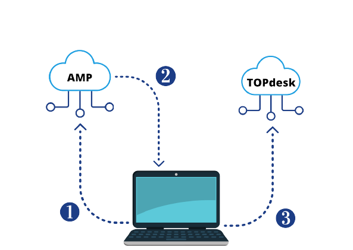

# Integrating Cisco Advanced Malware Protection (AMP) with TOPdesk
### My challenge

To create a way to be update about new threat events directly on TOPdesk, these events are created on AMP. Knowing that 
both applications have a public API, I wish to integrate them. 

Accomplishing this, I hope to help me and my team to be aware if any threats were detected in our environment and work on it.

### My solution

1. I request the last 10 events. This request is based on event type and, at this moment, I am only looking for two types ( Threat Detected and Retrospective Detection).
2. For each item in the response, I check some properties to pass only events that weren’t registered. Requesting TOPdesk’s API only when necessary. 
3. I struct the main information of the item and open a ticket on TOPdesk.

